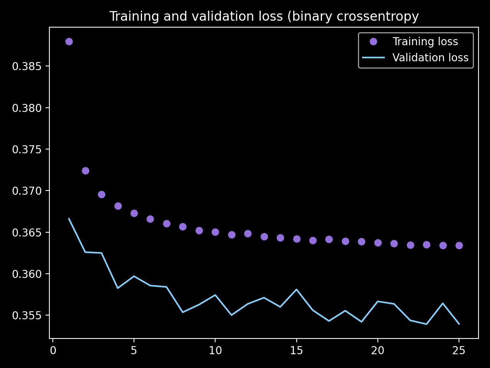
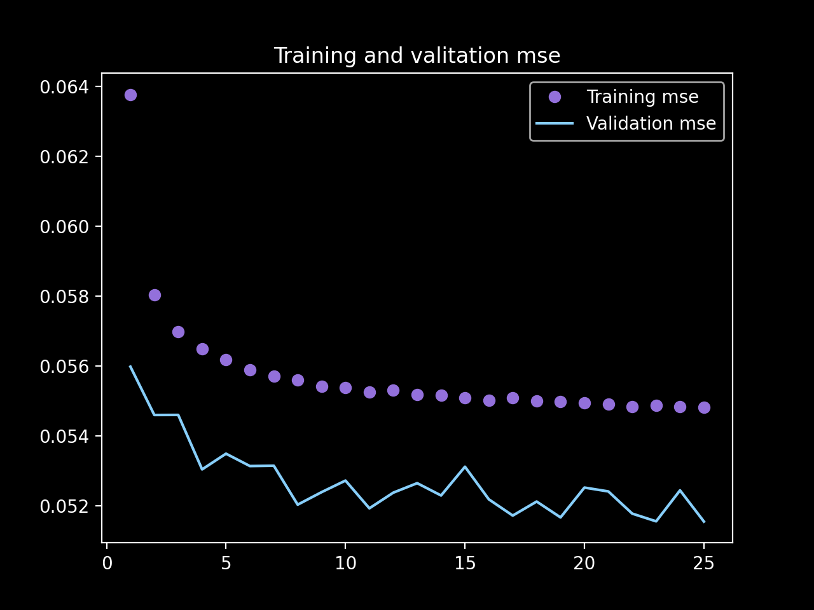

# GalaxyID: Using Convolutional Neural Networks to Classify Galaxies

## Background

Understanding the complex structure of galaxies and their distribution in the universe helps astronomers piece together our own cosmic origins. However, the sheer number of galaxies make it impossible for the lone astronomer to classify galaxies individually.
The goal of this project is to use the power of computer vision and deep neural networks to classiy the structure of a large sample of galaxies. To accomplish this task, I built a Convolutional Neural Network (CNN) using Keras and trained it on pre-labeled images of galaxies.

## Data

The data comes from the Galaxy Zoo 2 Project. Galaxy Zoo 2 is a citizen science project that uses volunteers to classify the structural properties of 304,122 galaxies from the Sloan Digital Sky Survey. 
It expands on the original Galaxy Zoo project by classifying the finer details of the brightest and largest galaxies identified in the original, including galactic bars, spiral arms, bulges and many other details.

The images, originally from [Sloan Digital Sky Survey Data Release 7](https://classic.sdss.org/dr7/), were converted into jpegs and uploaded to [Kaggle](https://www.kaggle.com/jaimetrickz/galaxy-zoo-2-images).  

Users were asked a series of questions to identify the features of galaxies following this decision tree:

[Decision Tree, Willett et al](https://static.zooniverse.org/data.galaxyzoo.org/gz_trees/images/gz2_tree_crop.pdf)

The researchers applied weights and debiased the responses (outlined [here](https://arxiv.org/pdf/1308.3496v2.pdf)) generating a proability for each of the morphology classes.
Some of these classes include:
- Elliptical
- Elliptical Cigar-shaped
- Spiral
- Barred Spiral
- Disk / Edge-On
- Irregular shape
- Odd Features

## Methods

I began by converting the table to include only debiased probabilities for 37 galaxy classes. Then I built a data pipeline (src/data_pipe.py) to seperate the images and table into three directories of training, validation and testing data. The pipeline also crops and resizes the images to 64x64x3.

Then I began building my CNN model (src/cnn.py) from the ground up. Initially I built the model with no regularization or dropout to see if it would overfit the data. However, after a couple epochs, the test scores plateaued at a los of 0.45. This was likely due to the images not being converted to grayscale. I believe the model was overweighting the color features because spiral galaxies tend to be blue from the high rate of star birth in their spiral arms. After converting every image to grayscale and adding regularization and dropout layers, the model improved drammatically. 

The final model had the following architecture and parameters:

Best CNN Architecture:
- 4 Convolutional layers with ReLU activation
- 3 Max Pooling layers
- 2 Dropout layers
- 1 Sigmoid Activation layer

Parameters:
- Optimization:         Adam
- Learning Rate:        0.001
- Loss:                 Binary Crossentropy
- Droupout:             0.5         
- Image size:           64x64x1
- Number of classes:    37
- Batch size:           Epochs:        25  (converged before 10)

## Results
The final model had a loss of 0.35 and MSE of 0.05. I plotted the loss and MSE per epoch as the model ran:
    

After creating a prediction table, I converted both prediction and the original table labels to Booleans to compare how the galaxy classifications compare. I plotted some of the images with both the prediction and classification labels below:

###### Correct:

|        edge-view spiral        |           elliptical           |              spiral             |
|:------------------------------:|:------------------------------:|:-------------------------------:|
||||

###### Incorrect:

|        edge-view spiral        |           elliptical           |              spiral             |
|:------------------------------:|:------------------------------:|:-------------------------------:|
||||

## Conclusion:
Given a loss 0.35, this model could use improvement. One consideration is this model does not include class weight balancing, which may improve the model's predictions. The model also appears to be underfitting with the training data. This may be due to the image augmentation implemented for the training data. Additionally, it would be interesting to compare the model to other 'state of the art' models such as Xception or ResNet.

## References:

Research:
- Willett et al. Galaxy Zoo 2: detailed morphological classifications for 304,122 galaxies from the Sloan Digital Sky Survey 2013

Reference Models:
- [Sander Dieleman](https://benanne.github.io/2014/04/05/galaxy-zoo.html)
- [Emily Levis](https://github.com/emle2899/CNN_galaxy_classification)

Data:
- [Table: Galaxy Zoo](www.galaxyzoo.org)
- [Images: Kaggle](https://www.kaggle.com/jaimetrickz/galaxy-zoo-2-images)
